# 💡 Topic

- **원하는 분위기에 맞는이미지 기반 관광지 추천 서비스**

# 📝 Summary

<p align="center">
  
</p>


|주제|원하는 분위기에 맞는이미지 기반 관광지 추천 서비스|
|---|---|
|기간|2023.12.27 ~ 2024.02.08|
|인원|5명|
|대상|원하는 분위기의 관광지를 찾고싶은 사용자들|
|기획의도|기존의 관광지 추천 서비스들은 대부분 텍스트 기반으로, 사용자가 원하는 분위기를 정확하게 파악하고 전달하는데 한계가 있기 때문에, 이미지 기반으로 사용자가 원하는 분위기를 찾을 수 있는 서비스를 제공하고자한다|


### <개요>
1. 6개의 키워드(자연, 모험적인, 전통적인, 문화적인, 예술적인, 활발한)에 따른
분위기 이미지 수집 및 전처리
2. 딥러닝 모델 CNN 기법을 활용하여 수집한 분위기 이미지를 각 키
워드에 맞게 분류하는 모델 생성
3. 관광지 이미지와 정보 데이터 수집 후 대표 이미지와 서비스 구축
에 필요한 데이터 선정
4. 모델링 및 설문 결과를 활용하여 가중치 설정 후 관광지 - 분위기
매핑
5. aws 환경 셋팅 및 데이터 파이프라인 구축
6. 최종적으로 개발한 관광지 추천 서비스를 Django 웹 서비스로 구
현

# ⭐️ Key Function


- 관광지 검색량 및 리뷰 **`데이터 크롤링`** 을 통한 각 키워드별 1 ~ 9 순위까지 인기있는 관광지 추천
- InceptionV3 모델에 다중 이미지를 **`학습 및 전처리`** 를통해 **`모델 성능 80% 이상 달성`**
- 총 6개의 키워드를 기반으로 랜덤하게 2장의 이미지씩 총 12개 이미지 제시하여 사용자가 3장의 **`이미지를 선택`** 하여 **`CNN`** 모델을 통해 분석하여 관광지 추천 
- **`이미지 업로드`** 를 통한 개인화된 접근으로 자신의 취향과 선호도에 맞는 관광지 추천 가능
- 로그인 기능을 통한 회원들에게 **`차별화된 서비스`**` 제공
- 자유게시판을 통한 사용자들이 자신의 경험을 공유하고 다른 사용자들과 **`상호 작용`** 가능
- 고객센터 게시판을 통해 사용자들이 서비스 이용 중 겪는 문제를 해결할 수 있게 도와주며 사용자들의 **`피드백 수렴`** 가능
- 내 프로필 페이지를 통한 자신의 활동 내역(작성한 게시물, 댓글 및 좋아요) 확인 가능 및 해당 게시글로 이동 가능 


# 🛠 Tech Stack 


`Excel`, `Jupyter notebook`, `VScode`, `Python`,`HTML`, `CSS`,`AWS`,`Numpy`,`Pandas`,`Airflow`, `Docker`, `Hadoop`, `Django`,`Spark`,`MySQL`,`JSON`,`CNN`,`Seaborn`,`Matplotlib`

# ⚙️ Architecture

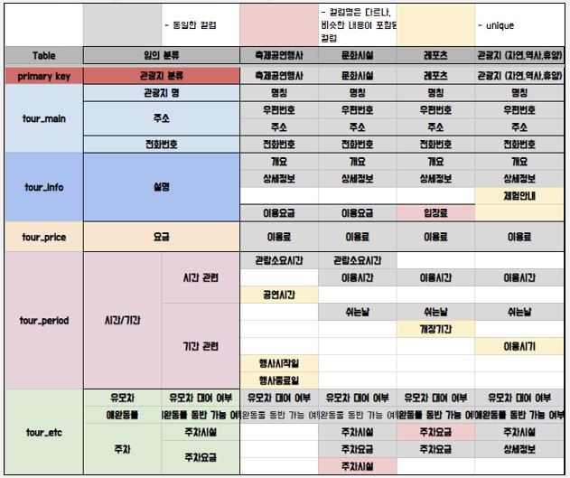
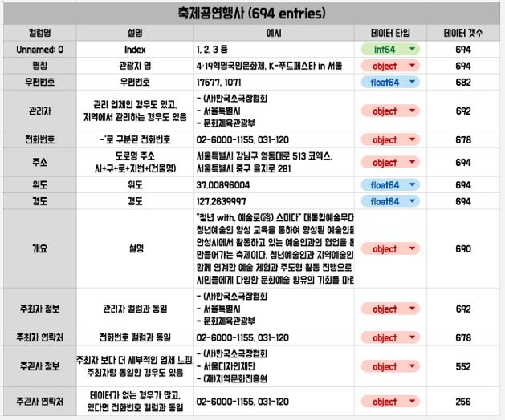
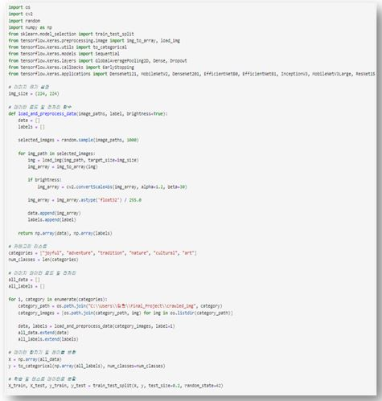
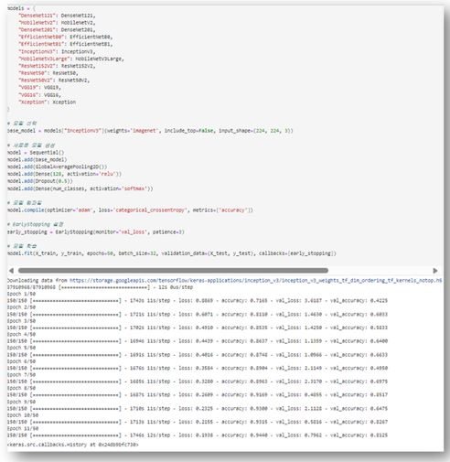
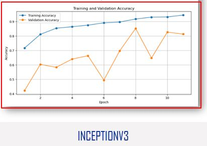
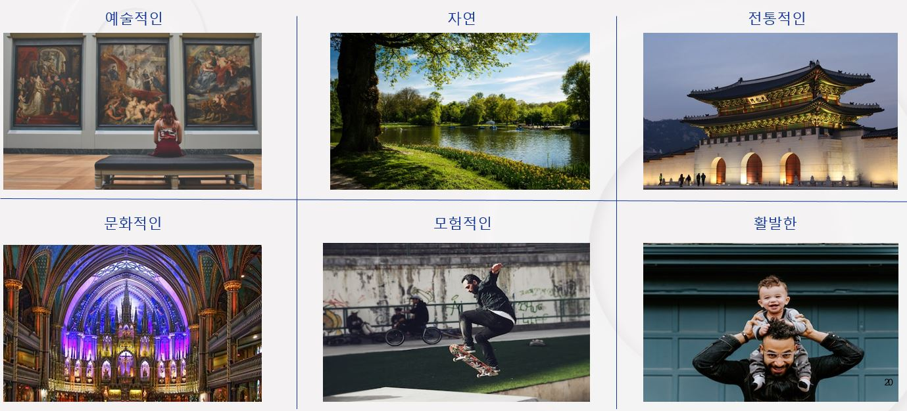
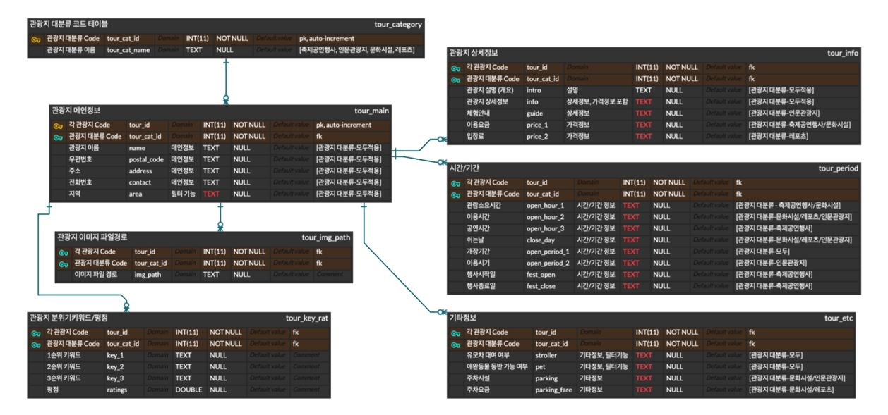
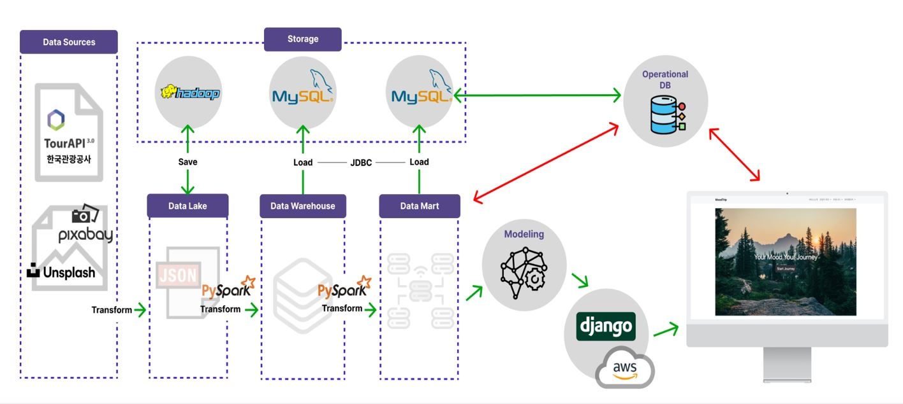
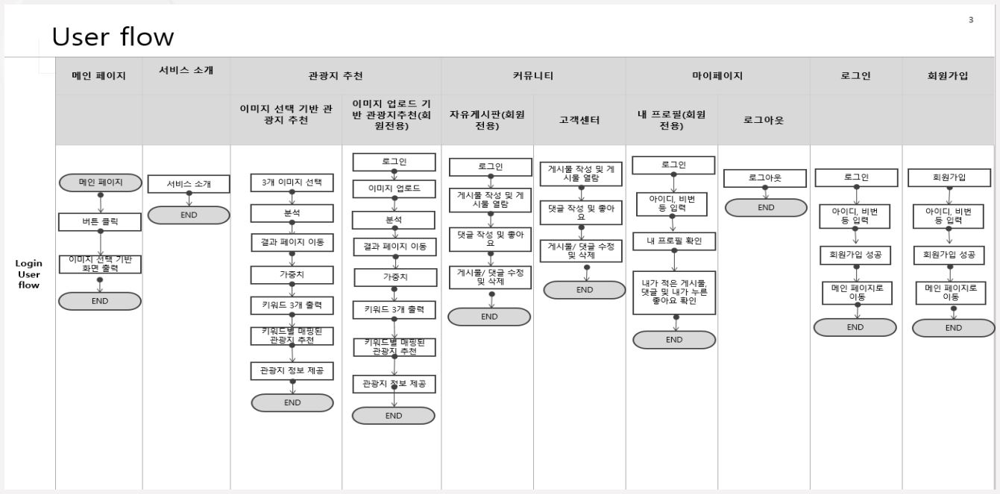


# 📷 Screenshot

### 프로젝트 구조

```
📦MoodTrip
 ┣ 📂media
 ┃ ┗ 📂images
 ┣ 📂Moodmatcher
 ┃ ┣ 📂migrations
 ┃ ┣ 📂models
 ┃ ┃ ┗ 📜TL_inception.h5
 ┃ ┣ 📂templates
 ┃ ┃ ┗ 📂Moodmatcher
 ┃ ┃ ┃ ┣ 📜image_choice_recommend.html
 ┃ ┃ ┃ ┣ 📜image_choice_recommend_result.html
 ┃ ┃ ┃ ┣ 📜image_upload_recommend.html
 ┃ ┃ ┃ ┣ 📜image_upload_recommend_result.html
 ┃ ┃ ┃ ┣ 📜recommend_overview.html
 ┃ ┃ ┃ ┗ 📜selected_spot.html
 ┃ ┣ 📜forms.py
 ┃ ┣ 📜models.py
 ┃ ┣ 📜urls.py
 ┃ ┣ 📜views.py
 ┃ ┗ 📜__init__.py
 ┣ 📂MoodTrip
 ┃ ┣ 📜settings.py
 ┃ ┣ 📜urls.py
 ┃ ┗ 📜__init__.py
 ┣ 📂Otherservices
 ┃ ┣ 📂migrations
 ┃ ┣ 📂templates
 ┃ ┃ ┗ 📂Otherservices
 ┃ ┃ ┃ ┣ 📜comment_delete.html
 ┃ ┃ ┃ ┣ 📜comment_update.html
 ┃ ┃ ┃ ┣ 📜community.html
 ┃ ┃ ┃ ┣ 📜customer_service.html
 ┃ ┃ ┃ ┣ 📜login.html
 ┃ ┃ ┃ ┣ 📜main.html
 ┃ ┃ ┃ ┣ 📜my_profile.html
 ┃ ┃ ┃ ┣ 📜post_create.html
 ┃ ┃ ┃ ┣ 📜post_create_customer_service.html
 ┃ ┃ ┃ ┣ 📜post_delete.html
 ┃ ┃ ┃ ┣ 📜post_detail.html
 ┃ ┃ ┃ ┣ 📜post_update.html
 ┃ ┃ ┃ ┣ 📜service_intro.html
 ┃ ┃ ┃ ┗ 📜signup.html
 ┃ ┣ 📜forms.py
 ┃ ┣ 📜models.py
 ┃ ┣ 📜urls.py
 ┃ ┣ 📜views.py
 ┃ ┗ 📜__init__.py
 ┣ 📂profile_pics
 ┣ 📂static
 ┃ ┣ 📂adventure
 ┃ ┣ 📂art
 ┃ ┣ 📂cultural
 ┃ ┣ 📂images
 ┃ ┣ 📂joyful
 ┃ ┣ 📂nature
 ┃ ┣ 📂tour_images
 ┃ ┗ 📂tradition
 ┣ 📂templates
 ┃ ┗ 📜base.html
 ┣ 📜db.sqlite3
 ┣ 📜manage.py
 ┣ 📜tourist_image_path.xlsx
 ┣ 📜tourist_keywords.xlsx
 ┗ 📜travel_data_idx.xlsx
        
```


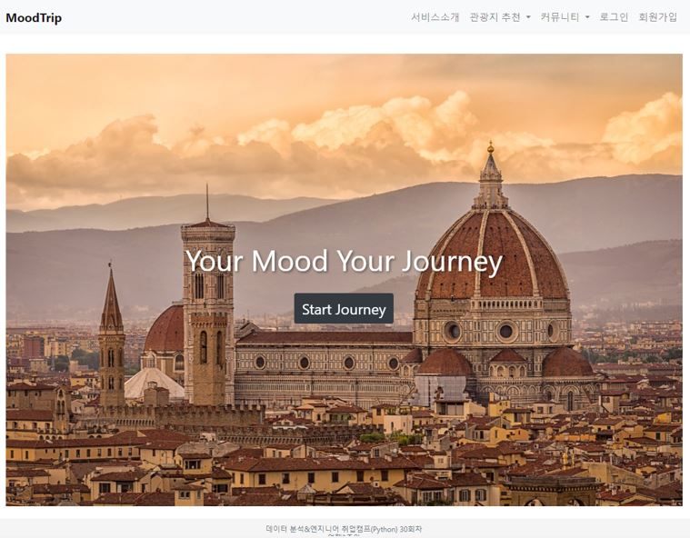
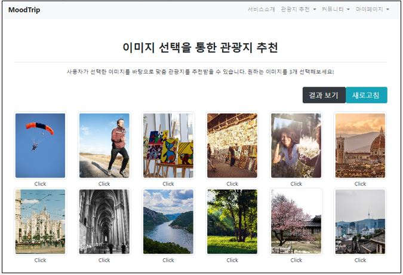
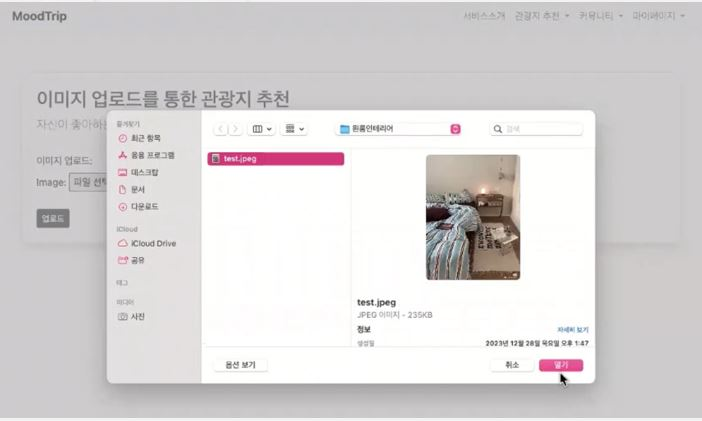
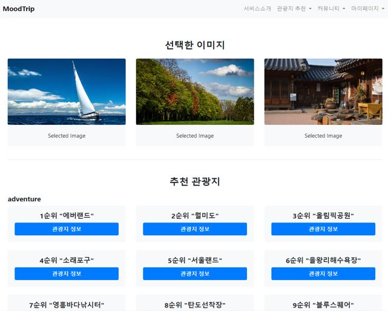
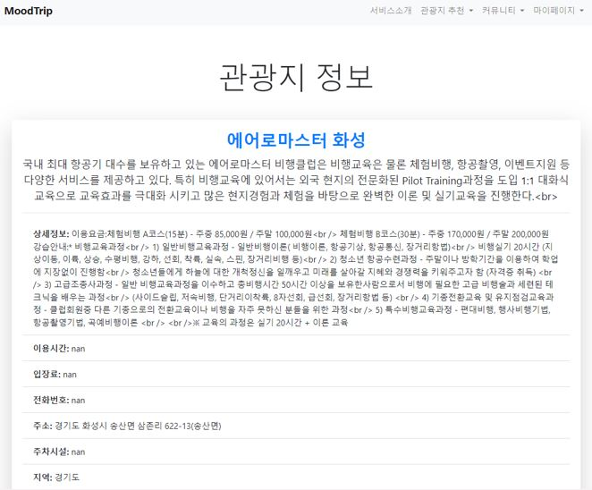
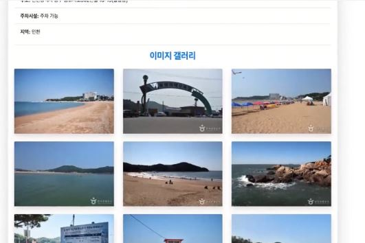
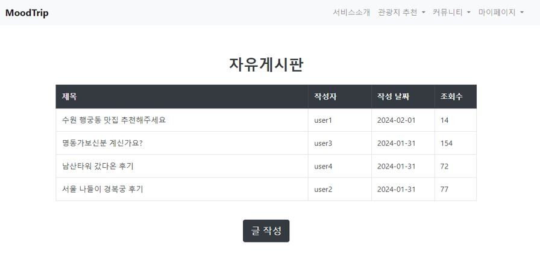
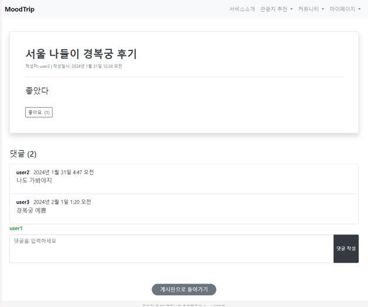
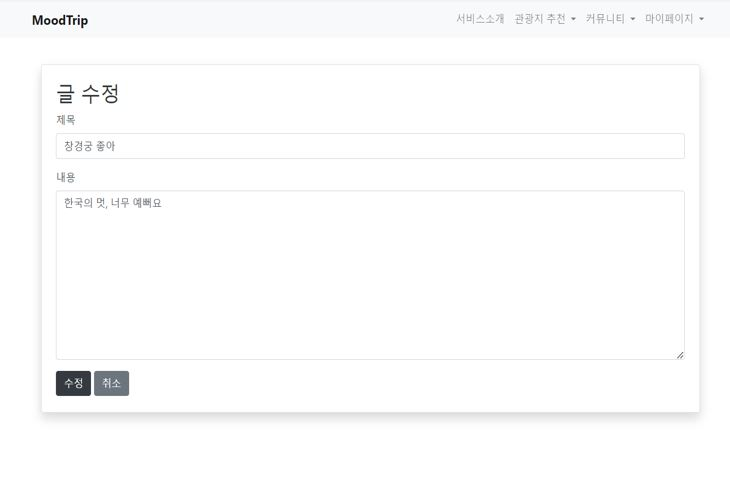
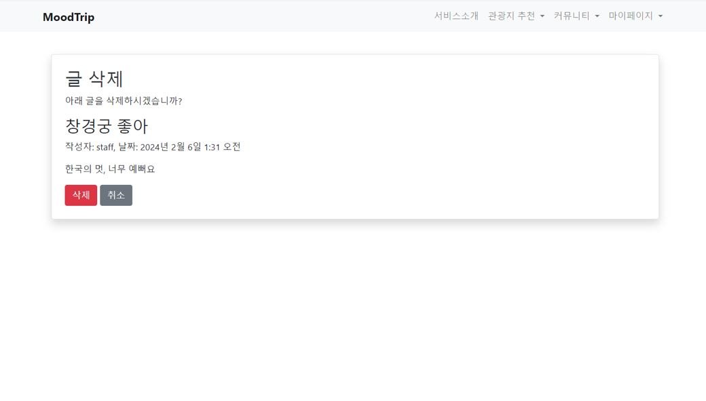
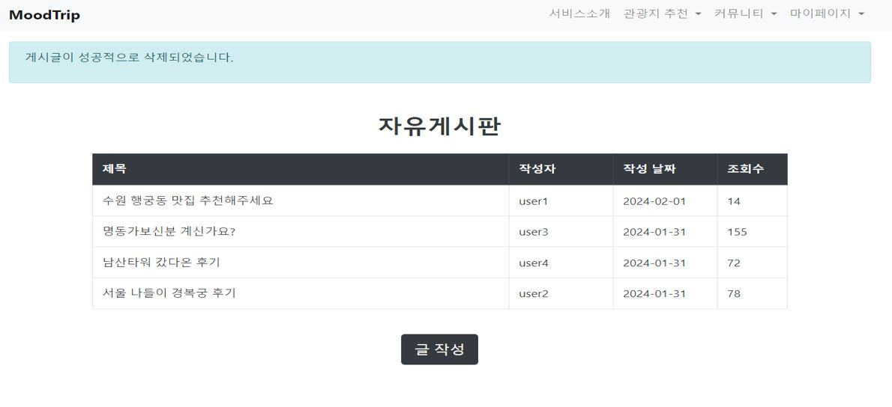
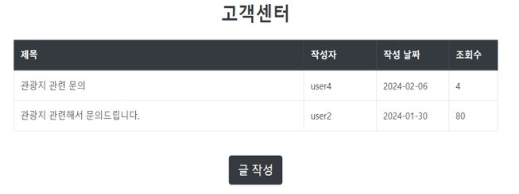
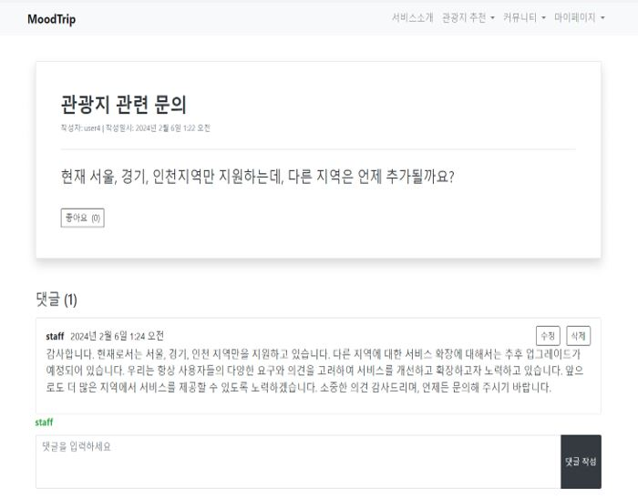
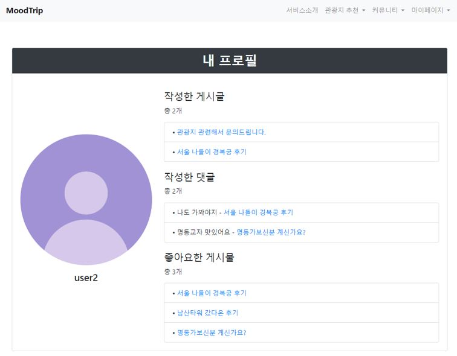
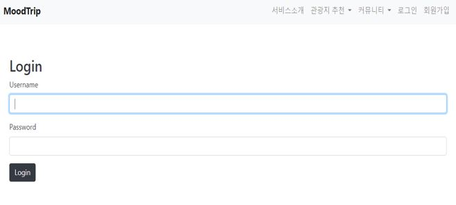
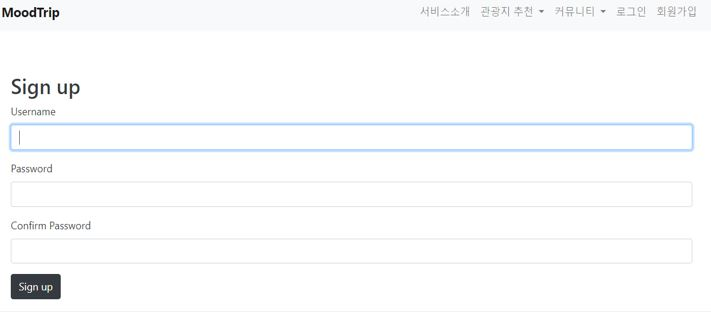
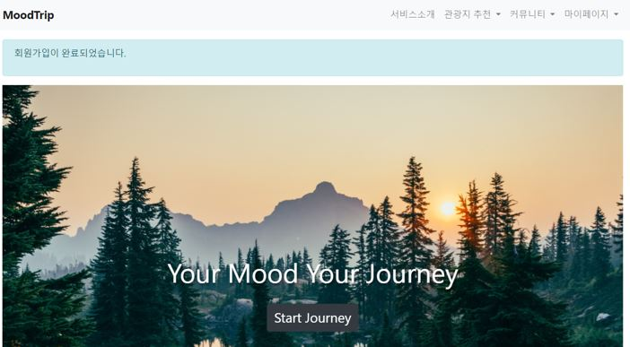


# 🤚🏻 Part

**팀 프로젝트(기업 요구사항 기반의 문제해결 프로젝트)**
- 네이버 평점 및 리뷰 수 크롤링
- 이미지 데이터 크롤링
- 데이터 수집/전처리
- 이미지 전처리
- CNN 모델 개발
- 모델링 개선
- Django 웹 서비스 구현

# 🤔 Learned

- 관광지 검색량, 리뷰데이터, 이미지 데이터등을 수집을 통한 **`크롤링 및 데이터 수집`** 능력 향상
- AWS 환경에서 **`데이터 파이프라인 구축`** 하는 경험을 통해 **`대규모 데이터 처리 방법`** 에 대한 이해도 향상
- 딥러닝 CNN 모델 구축, 개선 및 모델 평가하는 과정에서 **`딥러닝`** 에 대해 심화 학습
- 웹 서비스 구현 과정에서 **`UI/UX`** 에 대해 고려하는 서비스 구현 방법 학습
- 프로젝트를 진행하며 **`효율적인 프로젝트 일정 관리`** 및 팀원과의 **`의견 조율 능력`** 강화
